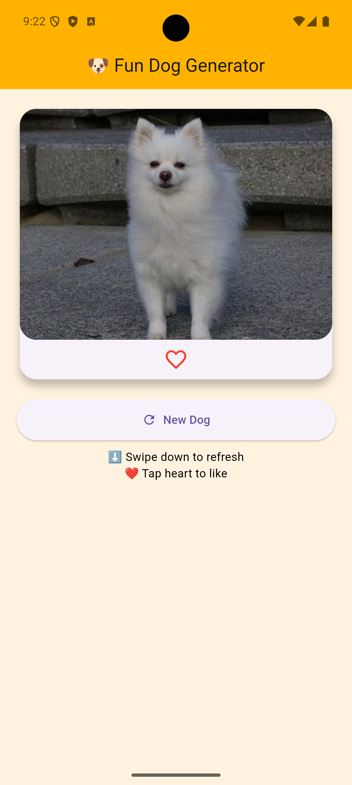
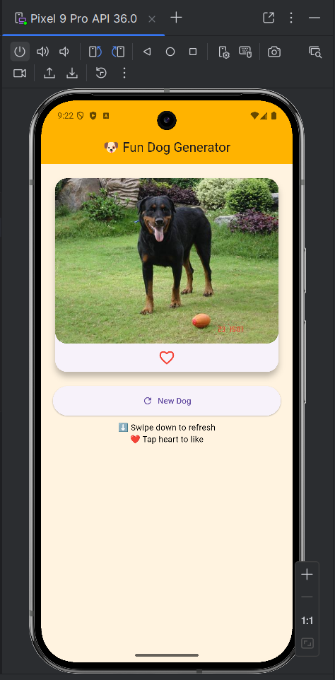
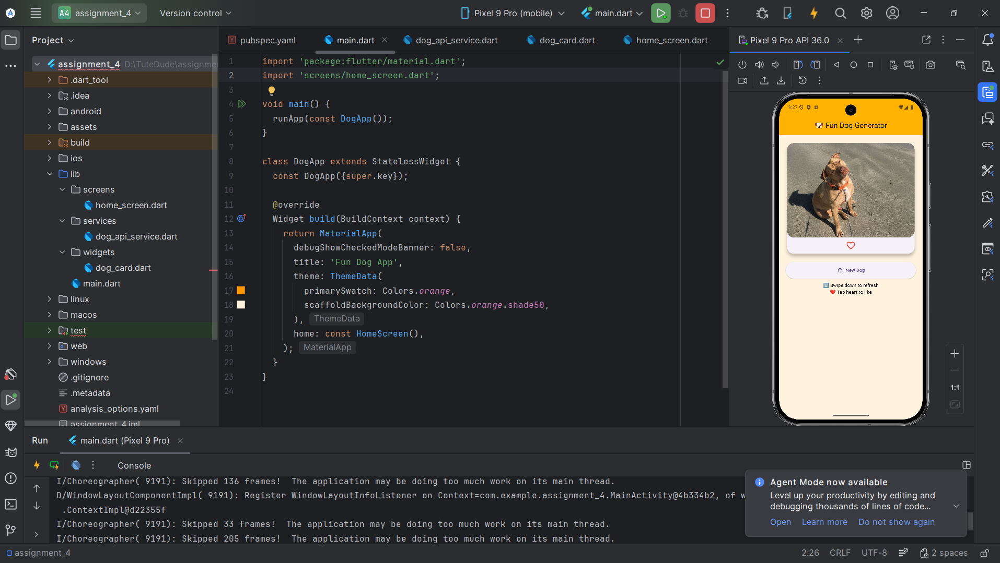
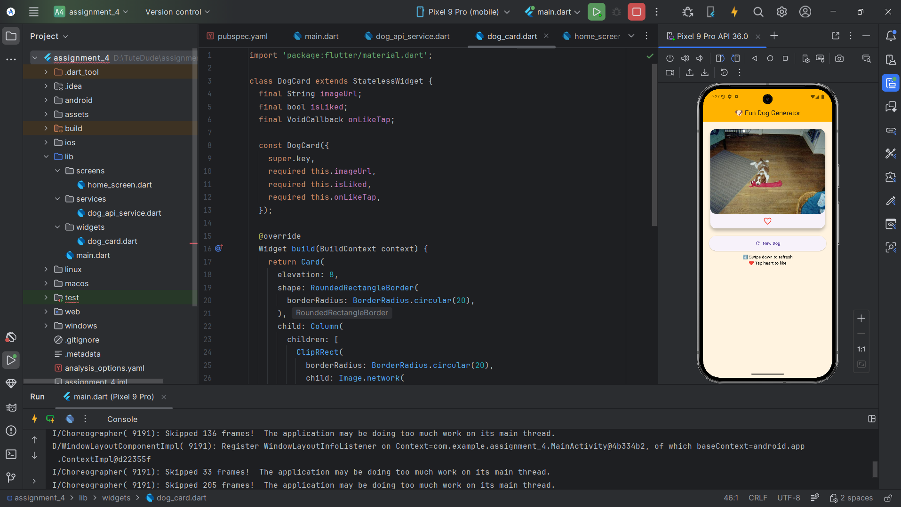
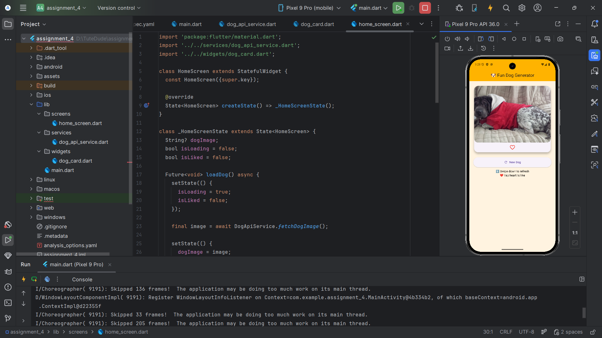

## 🖼️ Screenshot

  
  
  
  
  
  
  

---

# 🐶 Fun Random Dog App (Flutter)

A fun and interactive Flutter application that displays random dog images using an external API.
This app is built as part of an assignment to explore and creatively use Flutter packages from pub.dev.

---

## 🚀 Features
- Fetches random dog images from the internet
- Pull-to-refresh to load a new image
- Like / Unlike feature with heart icon
- Clean and attractive UI
- Loading indicator while fetching images

---

## 📦 Packages Used
- http — for fetching data from API

---

## 🌐 API Used
https://dog.ceo/api/breeds/image/random

---

## 👨‍🎓 Assignment Objective
To explore Flutter packages by building a fun and interactive mini application.

---

## ✍️ Author
Mohd Danish
